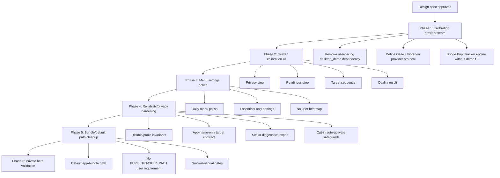

# Gaze Private Daily-Driver Beta Action Plan

Date: 2026-05-17
Status: Execution-ready phase plan
Input spec: `docs/product/2026-05-17-private-daily-driver-beta-design-spec.md`

## Goal

Ship Gaze as a polished private daily-driver beta for Sage: menu-bar-first, calm premium UX, Gaze-owned guided calibration, manual Cmd+G by default, opt-in auto-activate with debounce configuration, app-name-only target preview, scalar-only diagnostics, and no user-facing prototype/developer seams.

## Strategy

Sequence work around trust. The first visible trust moment is calibration, so Phase 1 replaces the user-facing PupilTracker demo dependency with a Gaze-owned calibration flow. UI polish then wraps the real product path rather than decorating a workaround.

The plan uses six phases:

1. Calibration architecture and provider seam.
2. Gaze-owned guided calibration UI.
3. Menu bar and settings polish.
4. Daily-driver reliability and privacy hardening.
5. Bundle/default path cleanup and validation.
6. Final private beta review.

Each phase should be implemented with TDD where possible, small commits, and verification gates. After this phase plan is approved, write a task-by-task TDD implementation plan for Phase 1.

## Decision Summary

- Product target: private daily-driver beta.
- Primary UX: menu bar + polished setup/settings window.
- Visual direction: calm premium utility.
- Calibration: Gaze-owned UI, PupilTracker engine.
- Heatmap: not user-facing.
- Target preview: app name only.
- Settings: essentials plus approved automation controls for auto-activate on/off and bounded debounce configuration.
- Diagnostics: quiet scalar export.
- Distribution: local/private daily-driver build; signed/notarized distribution is not required yet.

## Dependency Graph

## Phase 1: Calibration Architecture and Provider Seam

### Objective

Create the foundation for a Gaze-owned calibration experience that uses PupilTracker as an engine without launching PupilTracker's `desktop_demo` as the product UI.

### Scope

- Define a Gaze calibration provider boundary.
- Separate calibration UI state from PupilTracker demo process lifecycle.
- Identify the minimum PupilTracker APIs or internals needed for calibration samples/results.
- Keep the current dev path available only as fallback/internal validation during transition.
- Make failure states explicit: provider unavailable, camera unavailable, model unavailable, calibration retry required.

### Likely Files

- `src/gaze/tracking/calibration.py`
- `src/gaze/tracking/pupil_tracker_runtime.py`
- `src/gaze/tracking/pupil_tracker_adapter.py`
- `src/gaze/core/real_trust_preview.py`
- `tests/test_runtime_app_wiring.py`
- New tests as needed under `tests/`

### Acceptance

- Importing Gaze still has no camera/window/hotkey side effects.
- Unit tests can drive calibration provider states without launching a real camera.
- The provider seam can represent privacy, readiness, target sequence, result, retry, and unavailable states.
- User-facing code no longer assumes `desktop_demo.app` is the only calibration path.
- Existing `make check` passes.
- Existing dev-bundle path remains available until the new provider path passes manual validation.

### Verification

- Focused provider tests.
- `make check`.
- Confirm no visual/content-bearing diagnostics are introduced.

### Exit Gate

A follow-up Phase 2 implementation plan can build the guided wizard against this seam without touching PupilTracker demo UI.

## Phase 2: Gaze-Owned Guided Calibration UI

### Objective

Build the polished four-step calibration wizard as the primary trust surface.

### Scope

Wizard steps:

1. Privacy and camera permission explanation.
2. Camera/posture/readiness checks.
3. Calibration target sequence.
4. Quality result: ready, degraded, or retry required.

The UI should be calm premium utility style: native structure, soft panels, precise spacing, restrained accent, no gimmicks.

### Likely Files

- `src/gaze/ui/setup_window.py`
- `src/gaze/ui/window_factories.py`
- `src/gaze/ui/appkit_shell.py`
- `src/gaze/core/real_trust_preview.py`
- `src/gaze/settings/calibration_profile.py`
- New UI state/model files if needed.
- New tests under `tests/`.

### Acceptance

- First-run and Recalibrate open the Gaze-owned wizard.
- Camera permission is still just-in-time.
- Wizard copy explicitly states privacy boundaries.
- Retry/degraded/ready states are understandable without developer knowledge.
- Last-good scalar calibration persistence still works.
- Closing helper or wizard does not accidentally stop the live runtime unless the user quits/disables.
- No forbidden data appears in UI, logs, diagnostics/export, tests, docs, or validation evidence: screenshots, camera frames, raw visual/video payloads, window titles, document names, URLs, filenames, or raw desktop content.

### Verification

- UI model tests.
- Runtime wiring tests.
- Manual wizard walkthrough.
- `make check`.

### Exit Gate

A user can calibrate through Gaze UI and reach ready/degraded/retry state without seeing PupilTracker's demo UI as the product surface.

## Phase 3: Menu Bar and Settings Polish

### Objective

Make daily use feel polished, small, and trustworthy.

### Scope

Menu bar dropdown:

- Gaze enabled/disabled.
- Calibration state.
- Target app name or no target.
- Lock/readiness state.
- Cmd+G hint.
- Auto-activate mode indicator when enabled.
- Recalibrate.
- Settings.
- Quit.

Settings window:

- Status overview.
- Calibration status/recalibrate.
- Gaze on/off.
- Target border toggle.
- Hotkey display/editing.
- Auto-activate on/off, off by default.
- Bounded debounce configuration.
- Clear automation safety copy: disable stops all activation, Cmd+G remains available.
- Privacy summary.
- Export scalar summary.
- Reset local calibration.

Remove from user-facing UI:

- Heatmap.
- Per-app policy.
- Developer tuning knobs.

### Likely Files

- `src/gaze/ui/menu_model.py`
- `src/gaze/ui/appkit_shell.py`
- `src/gaze/ui/setup_window.py`
- `src/gaze/hotkeys/bindings.py`
- `src/gaze/core/diagnostics.py`
- `docs/validation/beta-ready-manual-validation.md`

### Acceptance

- Menu remains usable through off, calibrating, ready, degraded, retry, disabled, and no-target states.
- Settings is essentials plus the approved automation controls.
- Auto-activate controls are present but restrained: off by default, clearly labeled, bounded debounce, and never presented as required for daily use.
- Heatmap is not visible in private beta UI.
- Target detail is app-name-only.
- Hotkey conflicts/unavailable states have user-facing feedback.
- Visual copy is calm and non-technical.
- Developer-only surfaces, including heatmap/gaze trail diagnostics, fake gaze/window controls, and raw scalar bridge inspection, are absent from the default private beta launch and require an explicit development/debug/profile gate.

### Verification

- Menu model tests.
- AppKit shell smoke where possible.
- Manual menu/settings validation.
- `make check`.

### Exit Gate

Gaze can be used daily from the menu bar, with Settings reserved for calibration, privacy, hotkeys, diagnostics export, and reset.

## Phase 4: Daily-Driver Reliability and Privacy Hardening

### Objective

Lock down private beta invariants before relying on the app daily.

### Scope

- Disable/panic path invariants.
- Opt-in auto-activation safeguards.
- App-name-only target contract.
- Scalar-only diagnostics and export.
- Same-layout restart restore.
- Display-layout degradation messaging.
- Activation outcomes: success, already frontmost, no target, disabled, unavailable, debounce suppressed, cooldown suppressed.
- Border visibility and non-interference.

### Likely Files

- `src/gaze/core/real_trust_preview.py`
- `src/gaze/core/diagnostics.py`
- `src/gaze/core/target_selection.py`
- `src/gaze/desktop/activation.py`
- `src/gaze/settings/defaults.py`
- `src/gaze/overlays/border.py`
- `tests/test_real_trust_preview_controller.py`
- `tests/test_privacy_*` if needed.

### Acceptance

- Disable hides overlays, blocks activation, and clears or neutralizes current target/lock/preview state.
- Cmd+G activates only when Gaze is enabled and target is locked.
- Auto-activation is off by default, requires explicit opt-in, uses the same owning-app activation path as Cmd+G, and respects target lock, debounce, cooldown, disabled state, and already-frontmost suppression.
- No-target and already-frontmost paths are clear, non-crashing states.
- Scalar export contains no content-bearing fields.
- Privacy guard tests fail if any forbidden data is added to UI state, logs, diagnostics/export, docs, tests, or validation evidence: screenshots, camera frames, raw visual/video payloads, window titles, document names, URLs, filenames, or raw desktop content.
- Focused runtime tests prove no synthetic-click path is reachable in either manual or auto-activate mode.
- Single-display daily path remains stable.

### Verification

- Focused privacy tests.
- Focused activation tests.
- Focused auto-activate/debounce tests.
- `make check`.
- Manual disabled/no-target/already-frontmost walkthrough.
- Manual confirmation that auto-activation is off by default, opt-in only, respects debounce/cooldown, and never synthesizes clicks.

### Exit Gate

Daily-driver use cannot silently record content, activate while disabled, or expose unfinished user-facing controls.

## Phase 5: Bundle/Default Path Cleanup and Validation

### Objective

Make the normal local app path the real private beta path.

### Scope

- `make app-bundle` builds the app used for daily validation.
- Recalibrate works through the Gaze-owned calibration path without a user-facing `PUPIL_TRACKER_PATH` requirement.
- `app-bundle-pupil-dev` remains a developer override only.
- README and validation docs stop presenting source checkout as the daily-driver path.
- Local bundle smoke remains scalar-only.

### Likely Files

- `Makefile`
- `tools/build_app_bundle.py`
- `src/gaze/app.py`
- `README.md`
- `docs/validation/beta-ready-manual-validation.md`
- `docs/validation/beta-ready-review.md`

### Acceptance

- `make app-bundle` succeeds.
- `open dist/Gaze.app` launches native menu-bar app.
- Recalibrate opens Gaze-owned calibration UI.
- `make smoke-app-status-item` passes.
- README clearly separates normal daily-driver path from developer override path.
- `PUPIL_TRACKER_PATH` is not required for normal private beta use.

### Verification

- `make check`.
- `make app-bundle`.
- `make smoke-app-status-item`.
- Manual launch/recalibrate/enable/activate/quit walkthrough.

### Exit Gate

The default bundle is the app Sage uses daily.

## Phase 6: Final Private Beta Review

### Objective

Promote the app from implementation-complete to private daily-driver beta-ready.

### Scope

- Run automated gates.
- Run manual validation on the current hardware.
- Record scalar-only evidence.
- Update beta review decision.
- Document any hardware-blocked coverage explicitly.

### Required Gates

- `make check`
- `make app-bundle`
- `make smoke-app-status-item`
- Manual validation checklist.
- Scalar summary export.

Optional/developer validation:

- `make check-pupil-dev PUPIL_TRACKER_PATH=/Users/sage/workspace/sagebynature/pupil-tracker`

### Acceptance

- Menu-bar launch passes.
- Guided calibration passes or produces actionable retry guidance.
- Same-layout restart restore works.
- Target border lock works.
- Cmd+G activation works.
- Auto-activate is off by default; when enabled, it activates only after a locked target satisfies debounce/cooldown safeguards.
- Disable blocks activation, hides overlays, and clears or neutralizes current target/lock/preview state.
- App-name-only target preview is enforced.
- Heatmap is absent from user-facing UI.
- Developer diagnostics are absent from default private beta UI unless an explicit development/debug/profile gate is active.
- Synthetic-click paths are absent or unreachable in the private beta runtime.
- Auto-activate opt-in behavior and debounce configuration are validated.
- Scalar export is content-safe.
- Known hardware gaps are recorded rather than hidden.

### Exit Gate

`docs/validation/beta-ready-review.md` decision can be changed to private daily-driver beta-ready for Sage, with any remaining hardware-specific caveats stated plainly.

## First Tranche Recommendation

After this action plan is approved, create a detailed TDD plan for Phase 1 only:

1. Inventory PupilTracker calibration internals required by Gaze.
2. Define Gaze calibration provider protocol and state model.
3. Add fake provider tests for wizard states.
4. Add PupilTracker adapter tests for provider availability/unavailability.
5. Refactor current `desktop_demo` launcher behind a legacy/internal provider.
6. Add a new Gaze-owned provider seam that Phase 2 can drive.
7. Verify `make check`.
8. Commit the Phase 1 foundation.

## Stop Conditions

Pause and reassess before proceeding if:

- PupilTracker does not expose enough internals to support a Gaze-owned calibration UI without major invasive changes.
- The calibration UI requires raw camera/frame persistence to work.
- The Gaze-owned path would duplicate a large amount of PupilTracker model logic.
- Any proposed diagnostics require window titles, URLs, filenames, screenshots, or raw frames.
- UI work starts exposing unfinished controls to make implementation easier.

## Out of Scope For This Plan

- Invite-only/public distribution.
- Signing and notarization.
- Updater.
- Synthetic clicks.
- User-facing heatmap.
- Cross-Space activation.
- Exact individual-window raise.
- Cloud telemetry.
