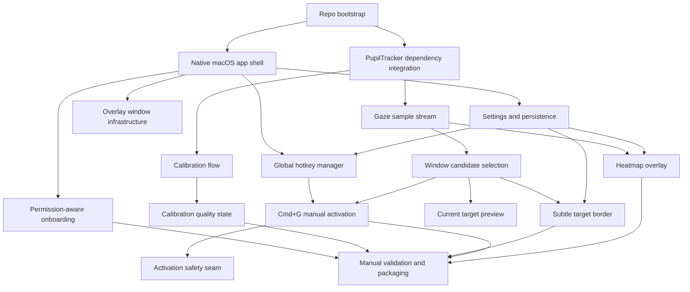
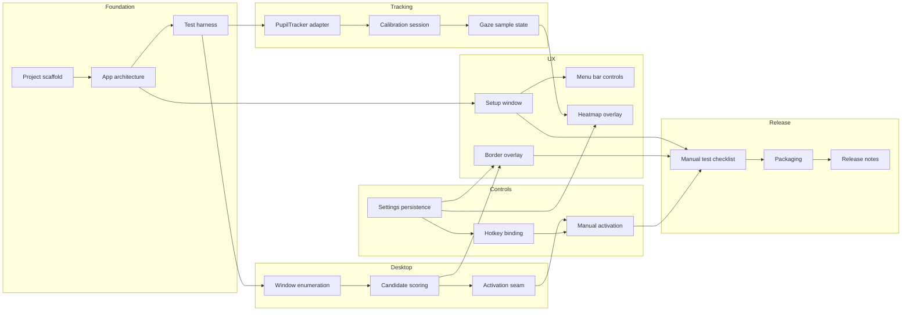
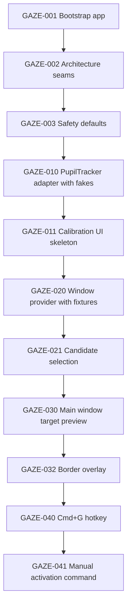
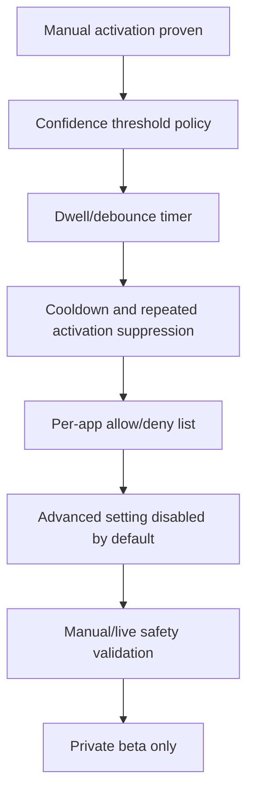

# Gaze Execution Task Graphs

Date: 2026-05-15
Status: Draft execution map
Inputs:
- `docs/product/gaze-prd-mvp.md`
- `../pupil-tracker/README.md`
- `../pupil-tracker/src/pupil_tracker/platform/macos_windows.py`
- `../pupil-tracker/src/pupil_tracker/platform/window_activation.py`
- `../pupil-tracker/src/pupil_tracker/screen/heatmap.py`

## Execution Strategy

Ship a trust-first MVP in small vertical slices. The first working path should not auto-focus anything. It should calibrate, identify the candidate window, draw a border, and activate only when the user presses Cmd+G.

Every implementation task should preserve these constraints:

- Gaze starts safe.
- Side effects are opt-in.
- No synthetic clicks.
- Activation is behind an injectable seam.
- Tests use fakes for camera, gaze samples, windows, hotkeys, and activation.
- Privacy-sensitive telemetry is opt-in and scalar-only by default.

## MVP Dependency Graph

## Workstream Graph

## MVP Task Inventory

### Phase 0: Repo and Architecture Foundation

#### GAZE-001: Bootstrap native macOS project

Objective: Create the initial app structure for a PyObjC/AppKit macOS app.

Outputs:
- Project metadata.
- Source directory for the Gaze app.
- Test directory.
- Basic launch command.
- Documentation for local setup.

Acceptance:
- App launches a blank native macOS window.
- Automated checks can run from one command.
- No PupilTracker or desktop side effects happen at import time.

Depends on: none

#### GAZE-002: Define app architecture boundaries

Objective: Establish clean seams before feature work starts.

Core modules:
- App shell and lifecycle.
- Tracking adapter.
- Calibration state.
- Window candidate service.
- Overlay service.
- Hotkey service.
- Activation service.
- Settings store.

Acceptance:
- Each service has a protocol/interface.
- Tests can fake each side-effecting service.
- App state can be tested without launching real UI.

Depends on: GAZE-001

#### GAZE-003: Add privacy and automation guardrails

Objective: Encode the safety rules before activation work.

Acceptance:
- Gaze is off by default.
- Activation cannot happen unless enabled and manually requested.
- No telemetry/log export exists without explicit user opt-in.
- Unit tests cover disabled behavior.

Depends on: GAZE-002

### Phase 1: Calibration and Tracking

#### GAZE-010: Integrate PupilTracker dependency

Objective: Connect the app to PupilTracker from PyPI/local development path.

Acceptance:
- App can import PupilTracker through the chosen dependency path.
- Missing dependency shows actionable setup guidance.
- Tests use fakes and do not require a camera.

Depends on: GAZE-001

#### GAZE-011: Build calibration onboarding

Objective: Provide first-run calibration and recalibration entry points.

Acceptance:
- Main window shows calibration state.
- User can start calibration.
- User receives quality result: ready, degraded, retry.
- Recalibration is available after initial setup.

Depends on: GAZE-010

#### GAZE-012: Create gaze sample state pipeline

Objective: Convert PupilTracker output into app-level gaze state.

Acceptance:
- Valid gaze samples update current gaze point.
- Invalid/low-confidence samples degrade state without crashing.
- Smoothing and confidence thresholds are configurable constants.
- Tests cover valid, invalid, and stale sample behavior.

Depends on: GAZE-011

### Phase 2: Window Targeting

#### GAZE-020: Implement visible-window provider

Objective: Use CoreGraphics/PupilTracker-compatible window metadata to get visible candidates.

Acceptance:
- Provider returns visible candidate bounds and app identity needed for activation.
- Hidden, transparent, offscreen, and non-normal-layer windows are filtered.
- Tests use fixture records and do not call real CoreGraphics.

Depends on: GAZE-002

#### GAZE-021: Implement gaze-to-window candidate selection

Objective: Select the best visible window under the current gaze point.

Acceptance:
- Topmost matching candidate wins.
- No target is selected outside all candidates.
- Candidate changes require a small stability window to avoid flicker.
- Tests cover overlapping windows and no-match cases.

Depends on: GAZE-012, GAZE-020

#### GAZE-022: Add current target preview model

Objective: Create a UI-safe target summary for the app window.

Acceptance:
- Preview can show target status without leaking unnecessary raw desktop details.
- App/window names can be hidden by privacy setting later.
- Tests cover no target, target locked, and low confidence.

Depends on: GAZE-021

### Phase 3: UI and Overlays

#### GAZE-030: Build main setup/control window

Objective: Implement the first Gaze window.

Required sections:
- Status header.
- Calibration/recalibration action.
- Current target preview.
- Enable Gaze toggle.
- Border toggle.
- Heatmap toggle.
- Manual activation hint.

Acceptance:
- User can understand whether Gaze is ready and enabled.
- Manual activation is presented as the MVP path.
- UI does not imply auto-activation is active.

Depends on: GAZE-011, GAZE-022

#### GAZE-031: Build menu bar control

Objective: Keep Gaze controllable without keeping the main window frontmost.

Acceptance:
- Menu bar shows status.
- User can enable/disable Gaze.
- User can start recalibration.
- User can open settings and quit.

Depends on: GAZE-030

#### GAZE-032: Implement target border overlay

Objective: Draw a subtle non-interactive border around the current target window.

Acceptance:
- Border is visible but not distracting.
- Border does not intercept mouse or keyboard input.
- Border follows target changes after stability threshold.
- Border can be toggled off.

Depends on: GAZE-021, GAZE-030

#### GAZE-033: Implement heatmap overlay

Objective: Show an optional gaze heatmap for calibration/debugging.

Acceptance:
- Heatmap is off by default.
- User can turn it on/off.
- User can clear it.
- Heatmap uses session-local decayed gaze points.

Depends on: GAZE-012, GAZE-030

### Phase 4: Hotkeys and Manual Activation

#### GAZE-040: Add global hotkey manager

Objective: Register and manage user-configurable hotkeys.

Default bindings:
- Manual activation: Cmd+G.
- Gaze on/off: unresolved; start user-configurable or choose after product decision.

Acceptance:
- Cmd+G can trigger an app-level command while Gaze is running.
- Hotkeys can be disabled/rebound in settings.
- Conflicts are surfaced if detectable.
- Tests use fake hotkey events.

Depends on: GAZE-030

#### GAZE-041: Implement manual activation command

Objective: Pressing Cmd+G activates the current gaze target.

Acceptance:
- If Gaze is disabled, Cmd+G does not activate anything.
- If no target is locked, app shows no-target status.
- If target exists, activation service is called once.
- Repeated activation is suppressed while target remains unchanged.
- Activation failure shows recoverable status.

Depends on: GAZE-021, GAZE-040

#### GAZE-042: Implement macOS activation service

Objective: Bring the candidate owning app to foreground using AppKit rather than synthetic input.

Acceptance:
- Service activates by process id when available.
- Missing process id returns unavailable.
- macOS refusal returns unavailable.
- Tests use fakes; no tests focus real apps.

Depends on: GAZE-041

### Phase 5: Settings, Persistence, and Safety

#### GAZE-050: Add settings persistence

Objective: Persist local user choices.

Settings:
- Gaze enabled state policy.
- Show border.
- Show heatmap.
- Activation hotkey.
- Gaze toggle hotkey.
- Calibration profile reference/state.

Acceptance:
- Settings survive app restart.
- Bad settings fall back safely.
- Activation remains off unless the app state explicitly enables Gaze.

Depends on: GAZE-030, GAZE-040

#### GAZE-051: Add explicit panic/disable path

Objective: Ensure the user can stop Gaze immediately.

Acceptance:
- UI toggle disables targeting side effects.
- Optional panic hotkey clears target, hides overlays, disables activation.
- Disable action is available from menu bar.

Depends on: GAZE-031, GAZE-041

### Phase 6: Validation and Packaging

#### GAZE-060: Create manual validation checklist

Objective: Define the live hardware test path.

Acceptance:
- Checklist covers calibration, target border, heatmap, Cmd+G activation, disable path, failure paths, and privacy checks.
- Checklist includes multi-window and overlapping-window scenarios.
- Checklist includes no-camera and no-permission scenarios.

Depends on: GAZE-033, GAZE-042

#### GAZE-061: Package local macOS app build

Objective: Produce a locally runnable `.app` or equivalent developer build artifact.

Acceptance:
- App launches outside the source tree.
- Required permissions are documented.
- Missing model/dependency guidance is clear.

Depends on: GAZE-060

#### GAZE-062: MVP release review

Objective: Decide whether the MVP is ready for broader testing.

Acceptance:
- All automated checks pass.
- Manual checklist passes or known issues are documented.
- Auto-activation remains disabled/not shipped as default.
- PRD and task graph are updated with any scope changes.

Depends on: GAZE-061

## Recommended First Implementation Slice

This slice gives us a testable end-to-end path without auto-activation.

## Later Auto-Activation Graph

Do not start this graph until manual activation is reliable.

## Decision Gates

### Gate 1: Native architecture accepted

Before writing feature code, confirm the app stack:
- PyObjC/AppKit native shell.
- PupilTracker imported as Python package.
- CoreGraphics/AppKit for window targeting and activation.

### Gate 2: Calibration quality acceptable

Do not build activation polish until calibration produces usable target stability.

### Gate 3: Border trust acceptable

Do not enable auto-activation until the border preview feels trustworthy in real multi-window use.

### Gate 4: Manual activation safe

Manual Cmd+G must handle these cases safely:
- Gaze off.
- No target.
- Low confidence.
- Target disappears.
- macOS activation refused.
- Same target repeatedly requested.

### Gate 5: Auto-activation product decision

Auto-activation requires a separate explicit decision and should remain disabled by default.

## Open Decisions to Resolve Before Coding

1. Default hotkey for Gaze on/off.
2. Whether panic disable is MVP or first post-MVP.
3. Whether app/window names are visible by default in the main window.
4. How calibration profile persistence handles display changes.
5. Local development dependency mode: PyPI package only, editable sibling package, or both.
