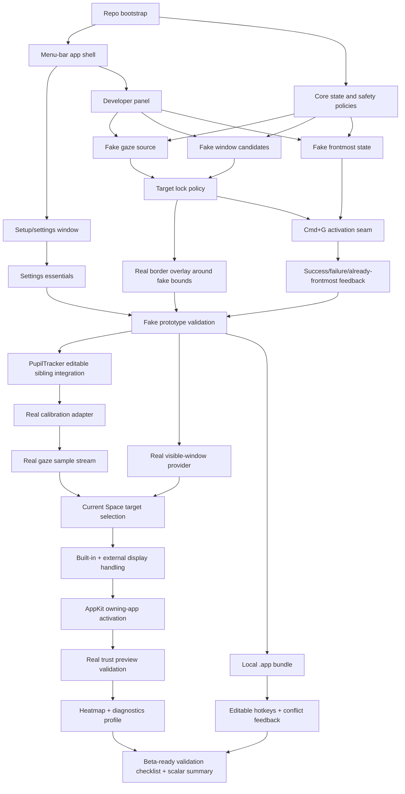
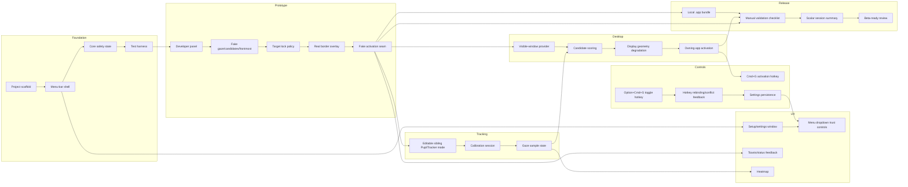
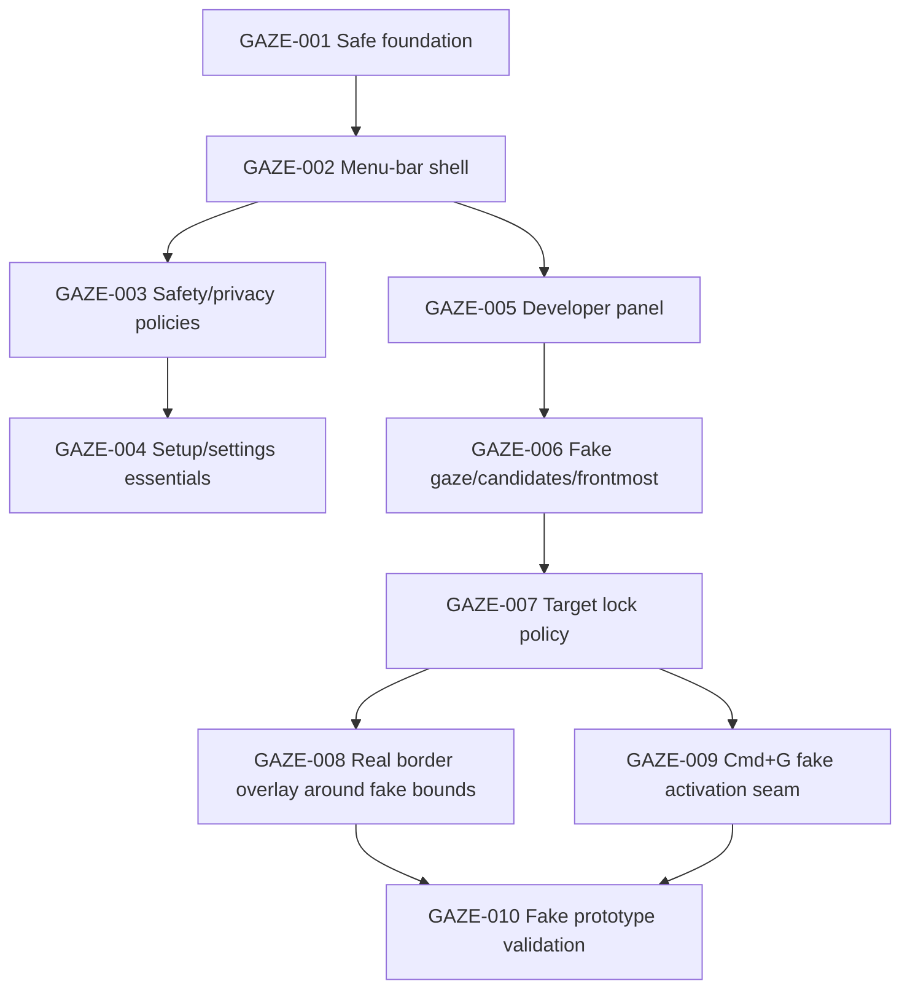
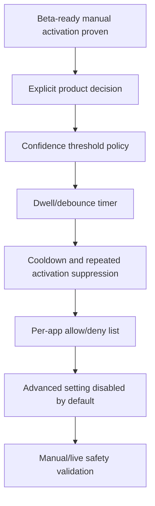

# Gaze Execution Task Graphs

Date: 2026-05-15
Status: Updated execution map after menu-bar beta design approval
Inputs:
- `docs/product/gaze-prd-mvp.md`
- `docs/superpowers/specs/2026-05-15-gaze-menu-bar-beta-design.md`
- `../pupil-tracker/README.md`
- `../pupil-tracker/src/pupil_tracker/platform/macos_windows.py`
- `../pupil-tracker/src/pupil_tracker/platform/window_activation.py`
- `../pupil-tracker/src/pupil_tracker/screen/heatmap.py`

## Execution Strategy

Ship Gaze through three controlled milestones:

1. Fake prototype.
2. Real trust preview.
3. Beta-ready for Sage.

The first working path should not touch camera, real window enumeration, or real app activation. It should prove the end-to-end trust loop with fake gaze, fake candidates, fake frontmost state, a real non-interactive border overlay, and Cmd+G through an activation seam.

Every implementation task must preserve these constraints:

- Gaze starts safe and off.
- Side effects are opt-in.
- No auto-activation in MVP.
- No synthetic clicks.
- Disable behaves like a panic stop: clear target, hide overlays, block activation.
- Activation is behind an injectable seam.
- Tests use fakes for camera, gaze samples, windows, hotkeys, overlays, and activation.
- Privacy-sensitive diagnostics are scalar-only by default in dev and off in release/default profile.
- App/window names are not persisted; MVP UI may show app name only.

## MVP Dependency Graph

## Workstream Graph

## Milestone 1: Fake Prototype

### GAZE-001: Maintain safe project foundation

Objective: Preserve the current PyObjC/AppKit app scaffold and side-effect-free imports.

Outputs:
- Project metadata.
- Source directory for Gaze app.
- Test directory.
- Basic launch command.
- Safety documentation in README/specs.

Acceptance:
- App can launch from `make run` on macOS.
- Automated checks can run from one command.
- Importing modules does not start camera, enumerate windows, register hotkeys, draw overlays, or activate apps.

Depends on: none

### GAZE-002: Build menu-bar-first shell

Objective: Make the menu bar the primary daily surface.

Outputs:
- Menu bar icon with state variants for off, calibrating, ready, degraded.
- Menu dropdown/popover with trust controls.
- Open setup/settings action.
- Open Developer panel action in development builds.
- Quit action.

Acceptance:
- Gaze can be controlled without a persistent app dashboard window.
- Menu shows Gaze on/off, calibration status, target app name/no target, confidence/lock state, border toggle, heatmap toggle, recalibrate, settings, quit.
- Menu does not show window titles.

Depends on: GAZE-001

### GAZE-003: Encode safety and privacy policies

Objective: Make safety rules executable before feature work.

Acceptance:
- Gaze is off by default.
- Auto-activation is disabled and not exposed as an active MVP feature.
- Disable action clears target, hides overlays, and blocks activation.
- UI privacy model allows app name only and excludes window titles.
- Tests cover disabled/no-target behavior.

Depends on: GAZE-001

### GAZE-004: Build setup/settings essentials window

Objective: Provide a secondary surface for configuration and onboarding.

Scope:
- First-run explanation.
- Calibration entry point placeholder.
- Hotkey settings placeholders.
- Border toggle.
- Heatmap toggle.
- Privacy/name display policy.
- Diagnostics profile setting.

Acceptance:
- Settings contains MVP essentials only.
- Settings does not show auto-activation/debounce/per-app future controls.
- Setup explains no recording, no screenshots, no clicks, manual activation only.

Depends on: GAZE-002, GAZE-003

### GAZE-005: Build separate Developer panel

Objective: Keep fake/debug controls separate from product settings.

Acceptance:
- Developer panel can start/stop scripted fake target sequence.
- Developer panel can manually set fake target app, target bounds, confidence/lock state, frontmost app, activation success/failure, no-target, and degraded states.
- Developer panel is development-gated and does not appear as a normal product setting.

Depends on: GAZE-002

### GAZE-006: Implement fake gaze/candidate/frontmost services

Objective: Provide deterministic fake sources for the first end-to-end prototype.

Acceptance:
- Scripted sequence can emit target changes over time.
- Manual override can select fake targets and confidence.
- Fake frontmost app is a simple testable state variable.
- Tests cover fake target locked, no target, degraded, activation failure, already-frontmost.

Depends on: GAZE-005

### GAZE-007: Implement target lock policy

Objective: Decide when target preview and Cmd+G activation are allowed.

Policy:
- Balanced stability timing: roughly 300-500 ms.
- Border lock and manual activation threshold are the same.
- If border is locked, Cmd+G can activate.
- If no border is locked, Cmd+G reports no target/not ready.

Acceptance:
- Stable fake target becomes locked after threshold.
- Unstable target does not lock.
- Desktop/system/no-target state hides border and blocks activation.
- Tests cover target change and no-target cases.

Depends on: GAZE-006

### GAZE-008: Implement real non-interactive border overlay for fake candidates

Objective: Retire the core overlay risk early while using fake bounds.

Acceptance:
- Overlay draws a soft glow + thin outline around fake candidate bounds.
- Overlay is non-interactive and should not intercept mouse/keyboard input.
- Overlay hides when Gaze is disabled or no target is locked.
- Overlay style contract is unit-testable; click-through behavior is manually validated.

Depends on: GAZE-007

### GAZE-009: Implement Cmd+G activation seam with fake activation

Objective: Route manual activation through injectable activation logic.

Acceptance:
- Cmd+G with Gaze disabled does not activate.
- Cmd+G with no locked target does not activate and reports no target/not ready.
- Cmd+G with locked target and non-frontmost fake app calls fake activation once.
- Cmd+G with already-frontmost fake app reports Already frontmost and suppresses repeated activation.
- Activation failure shows subtle toast plus menu/status update.
- Successful activation shows brief success flash/toast and normal tracking continues.

Depends on: GAZE-007

### GAZE-010: Validate fake prototype

Objective: Produce evidence before moving to real camera/window APIs.

Acceptance:
- Automated checks pass.
- Manual checklist confirms overlay does not intercept input.
- Manual checklist confirms menu bar state, Developer panel states, border lock, Cmd+G, failure feedback, already-frontmost behavior, and disable/panic behavior.

Depends on: GAZE-008, GAZE-009

## Milestone 2: Real Trust Preview

### GAZE-020: Add editable sibling PupilTracker development mode

Objective: Use `../pupil-tracker` during development while preserving PyPI release path.

Acceptance:
- Local setup can install/use editable sibling PupilTracker.
- PyPI dependency path remains documented for release/default installs.
- Missing dependency produces actionable setup guidance.
- Tests use fakes and do not require a camera.

Depends on: GAZE-010

### GAZE-021: Build just-in-time calibration onboarding

Objective: Run real calibration without over-requesting permissions.

Acceptance:
- Camera permission is requested when calibration starts.
- No Accessibility prompt is requested unless a later real feature requires it.
- Calibration can produce ready, degraded, and retry-required states.
- Recalibration is available from menu and setup/settings.

Depends on: GAZE-020

### GAZE-022: Create real gaze sample state pipeline

Objective: Convert PupilTracker output into app-level gaze state.

Acceptance:
- Valid gaze samples update current gaze point.
- Invalid, stale, or low-confidence samples degrade state without crashing.
- Tests cover valid, invalid, stale, and degraded sample behavior.

Depends on: GAZE-021

### GAZE-023: Implement real visible-window provider

Objective: Enumerate current Space visible app windows using CoreGraphics/PupilTracker-compatible metadata.

Acceptance:
- Provider returns visible candidate bounds and app identity needed for activation.
- Hidden, transparent, offscreen, non-normal-layer, desktop, menu bar, Dock, and system UI are filtered or become no target.
- Tests use fixture records and do not call real CoreGraphics.

Depends on: GAZE-010

### GAZE-024: Implement real gaze-to-window target selection

Objective: Select the best visible candidate under the current gaze point.

Acceptance:
- Topmost matching current-Space candidate wins.
- No target is selected outside all candidates.
- Candidate changes obey stability timing.
- Tests cover overlapping windows, no-match, and system-UI/no-target cases.

Depends on: GAZE-022, GAZE-023

### GAZE-025: Handle built-in + external display geometry

Objective: Support Sage's variable built-in + one external display setups.

Acceptance:
- Display signature/geometry is recorded with last-good calibration.
- Display layout changes mark calibration degraded and recommend recalibration.
- Validation covers at least two built-in + external layouts.

Depends on: GAZE-021, GAZE-024

### GAZE-026: Implement AppKit owning-app activation

Objective: Bring the target owning app forward without synthetic input.

Acceptance:
- Service activates by owning process/app identity when available.
- Missing process/app identity returns unavailable.
- macOS refusal returns unavailable.
- If target app is already frontmost, return Already frontmost.
- Tests use fakes; no automated test focuses real apps.

Depends on: GAZE-024

### GAZE-027: Validate real trust preview

Objective: Prove real calibration, targeting, border, and owning-app activation before beta polish.

Acceptance:
- Automated checks pass.
- Manual validation covers Terminal/iTerm, browser, Discord, AI/chat apps, and repo editor.
- Manual validation covers built-in + external display layouts.
- No screenshots, frames, window titles, or raw desktop content are persisted.

Depends on: GAZE-025, GAZE-026

## Milestone 3: Beta-Ready for Sage

### GAZE-040: Add local `.app` bundle

Objective: Produce a local macOS app bundle for realistic lifecycle and permissions validation.

Acceptance:
- App launches outside the source tree.
- Required permissions are documented.
- Missing model/dependency guidance is clear.
- Signed/notarized distribution remains out of scope.

Depends on: GAZE-010

### GAZE-041: Add editable hotkeys and conflict feedback

Objective: Make hotkeys reliable for daily validation.

Defaults:
- Cmd+G: manual activation.
- Option+Cmd+G: Gaze on/off toggle.

Acceptance:
- Hotkeys can be disabled/rebound in settings.
- Registration failure or unavailable binding is surfaced clearly.
- Tests use fake hotkey events.

Depends on: GAZE-009, GAZE-004

### GAZE-042: Add scalar diagnostics profile

Objective: Provide evidence for tuning without content leakage.

Acceptance:
- Dev builds have scalar diagnostics on by default.
- Release/default profile has scalar diagnostics off by default.
- Diagnostics may include confidence, lock duration, calibration state, activation result, already-frontmost count, no-target count, display-layout-degraded events, and hotkey registration status.
- Diagnostics never include frames, screenshots, window titles, or raw desktop content.

Depends on: GAZE-027

### GAZE-043: Polish border, heatmap, and feedback

Objective: Make the trust surfaces calm enough for daily validation.

Acceptance:
- Border uses soft glow + thin outline.
- Heatmap is optional, off by default, session-local, and clearable.
- Success/failure feedback is subtle and non-modal.
- No feedback UI intercepts input.

Depends on: GAZE-027, GAZE-042

### GAZE-044: Create manual validation checklist and scalar summary export

Objective: Define the beta-ready evidence path.

Acceptance:
- Checklist covers fake prototype, real trust preview, local `.app`, permissions, hotkeys, calibration, target border, heatmap, Cmd+G activation, disable/panic behavior, failure paths, display layout changes, and privacy checks.
- Scalar summary export contains no content.

Depends on: GAZE-040, GAZE-041, GAZE-043

### GAZE-045: Beta-ready review for Sage

Objective: Decide whether Gaze is ready for Sage's daily-driver validation.

Acceptance:
- All automated checks pass.
- Manual checklist passes or known issues are documented.
- Validation evidence covers Hermes/agent cockpit apps.
- Validation evidence covers variable built-in + external display layouts.
- Auto-activation, synthetic clicks, launch-at-login, window titles, cross-Space switching, and signed/notarized distribution remain out of scope.

Depends on: GAZE-044

## Recommended First Implementation Slice

This slice gives a testable end-to-end trust loop without real camera, real window enumeration, or real app activation.

## Later Auto-Activation Graph

Do not start this graph until the beta-ready MVP is trusted in daily use.

## Decision Gates

### Gate 1: Design accepted

Confirmed design source:
- `docs/superpowers/specs/2026-05-15-gaze-menu-bar-beta-design.md`

### Gate 2: Fake prototype safe

Before real camera/window APIs:
- Menu bar shell works.
- Developer panel can drive fake states.
- Real overlay is non-interactive.
- Cmd+G behavior is correct through fakes.
- Disable/panic behavior is correct.

### Gate 3: Real trust preview safe

Before beta-ready polish:
- Real calibration produces ready/degraded/retry states.
- Current-Space visible-window targeting works.
- Built-in + external display changes degrade calibration.
- AppKit owning-app activation works without synthetic clicks.

### Gate 4: Beta-ready for Sage

Before daily-driver validation:
- Local `.app` exists.
- Hotkeys are editable and conflict-aware.
- Manual validation checklist plus scalar session summary is available.
- Validation covers Sage's Hermes/agent cockpit.

### Gate 5: Auto-activation product decision

Auto-activation requires a separate explicit product decision and remains out of MVP.

## Resolved Decisions

1. PupilTracker dependency mode: editable sibling during development, PyPI path preserved for release.
2. Panic disable: disable action behaves as full panic stop; no dedicated panic hotkey in MVP.
3. App/window names: app name allowed by default; window title never shown in MVP.
4. App shell: menu-bar-first plus setup/settings window.
5. Calibration persistence: last-good profile, degraded when display geometry changes.
6. Activation confidence: strict target lock required.
7. Degraded calibration: preview and activation allowed when target is locked.
8. Multiple displays: built-in + one external first, variable layouts validated.
9. Border overlay: soft glow + thin outline.
10. Menu bar state: icon variants, no permanent target text.
11. Onboarding: trust path.
12. Heatmap: user-facing optional toggle, off by default.
13. Diagnostics: scalar-only local diagnostics.
14. Diagnostic defaults: dev on, release/default off.
15. Packaging target: local `.app` bundle before beta-ready validation.
16. Hotkey conflicts: editable hotkeys with conflict/unavailable feedback.
17. Default hotkeys: Cmd+G activation, Option+Cmd+G toggle.
18. Activation target: owning-app activation for MVP; best-effort window raise post-MVP.
19. Already-frontmost behavior: no-op with status.
20. First execution slice: thin vertical fake prototype.
21. Fake simulation: scripted sequence plus manual controls.
22. Fake/debug controls: separate Developer panel.
23. Menu dropdown: trust controls.
24. Settings scope: MVP essentials only.
25. Activation failure feedback: subtle toast plus menu/status.
26. UI privacy: app name only; no window titles.
27. Launch-at-login: out of MVP.
28. Permissions: just-in-time.
29. Manual validation: checklist plus scalar session summary.
30. MVP done: beta-ready for Sage.
31. Milestones: fake prototype, real trust preview, beta-ready MVP.
32. Beta tester profile: Sage only.
33. Primary workflow: coding cockpit.
34. Switching pattern: editor, terminal, browser/docs, AI/chat all important.
35. Display setup: built-in + one external first.
36. Display layout: variable; do not assume.
37. Validation app matrix: Hermes/agent cockpit.
38. Fullscreen/Spaces: current Space visible windows only.
39. System UI/desktop gaze: no target.
40. Target stability timing: balanced 300-500 ms.
41. Manual activation threshold: same as border lock.
42. Post-activation feedback: brief success flash/toast, continue tracking.
43. Repeated activation suppression: suppress only if already frontmost.
44. Fake frontmost state: simple fake variable.
45. Fake prototype border: real overlay window.
46. Overlay input safety: testable style contract plus manual validation.
47. Local `.app` timing: after fake prototype works via `make run`.
48. First repo-visible deliverable: design spec plus updated task graph.
